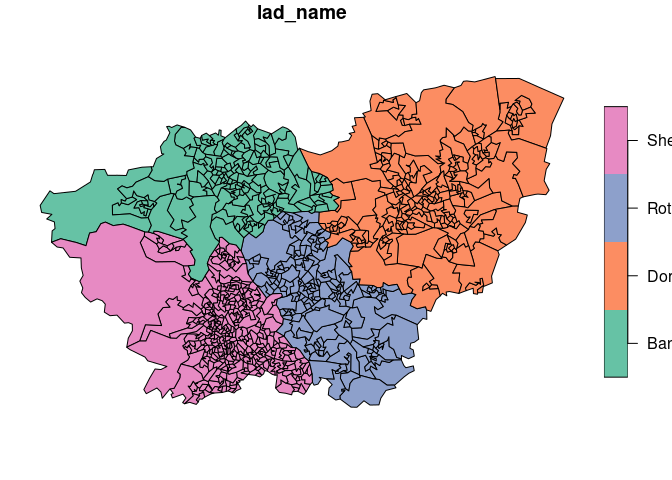
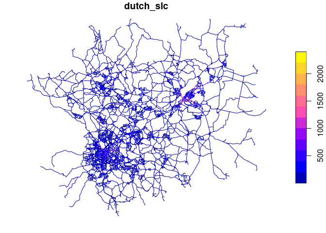

<!-- README.md is generated from README.Rmd. Please edit that file -->

# sheffield_cycle_data

<!-- badges: start -->
<!-- badges: end -->

The goal of sheffield_cycle_data is to get started with key datasets on
cycling, infrastructure, behaviour and maybe more.

## Set-up and packages

There are a number of packages that can help get transport (including
cycling) data. Install them as follows:

``` r
install.packages("remotes")
#> Installing package into '/home/robin/R/x86_64-pc-linux-gnu-library/4.1'
#> (as 'lib' is unspecified)
```

``` r
remotes::install_cran(c("pct", "osmextract", "osmdata", "stats19", "tidyverse"))
#> Skipping install of 'pct' from a cran remote, the SHA1 (0.9.3) has not changed since last install.
#>   Use `force = TRUE` to force installation
#> Skipping install of 'osmextract' from a cran remote, the SHA1 (0.4.0) has not changed since last install.
#>   Use `force = TRUE` to force installation
#> Skipping install of 'osmdata' from a cran remote, the SHA1 (0.1.9) has not changed since last install.
#>   Use `force = TRUE` to force installation
#> Skipping install of 'stats19' from a cran remote, the SHA1 (2.0.0) has not changed since last install.
#>   Use `force = TRUE` to force installation
#> Skipping install of 'tidyverse' from a cran remote, the SHA1 (1.3.1) has not changed since last install.
#>   Use `force = TRUE` to force installation
```

You can load them as follows:

``` r
library(pct)
library(stats19)
library(tidyverse)
#> ── Attaching packages ─────────────────────────────────────── tidyverse 1.3.1 ──
#> ✓ ggplot2 3.3.5     ✓ purrr   0.3.4
#> ✓ tibble  3.1.6     ✓ dplyr   1.0.8
#> ✓ tidyr   1.2.0     ✓ stringr 1.4.0
#> ✓ readr   2.1.2     ✓ forcats 0.5.1
#> ── Conflicts ────────────────────────────────────────── tidyverse_conflicts() ──
#> x dplyr::filter() masks stats::filter()
#> x dplyr::lag()    masks stats::lag()
```

## Cycling behaviour and potential

``` r
cycle_trips_network_estimates = get_pct_rnet(region = "south-yorkshire")
zones = get_pct_zones("south-yorkshire")
```

You can plot this data in a static map as follows:

``` r
zones %>% 
  select(lad_name) %>% 
  plot()
cycle_trips_network_estimates %>%
  select(dutch_slc) %>% 
  plot()
```



Let’s subset the data representing Sheffield.

``` r
zones_sheffield = zones %>% 
  filter(lad_name == "Sheffield")
```
