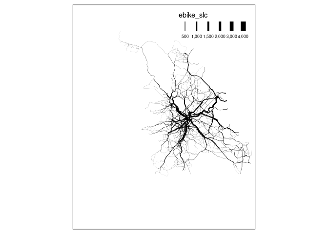

<!-- README.md is generated from README.Rmd. Please edit that file -->

# sheffield_cycle_data

<!-- badges: start -->
<!-- badges: end -->

The goal of sheffield_cycle_data is to get started with key datasets on
cycling, infrastructure, behaviour and maybe more.

## Set-up and packages

There are a number of packages that can help get transport (including
cycling) data. Install them as follows:

``` r
install.packages("remotes")
#> Installing package into '/home/robin/R/x86_64-pc-linux-gnu-library/4.1'
#> (as 'lib' is unspecified)
```

``` r
remotes::install_cran(c("pct", "osmextract", "osmdata", "stats19", "tidyverse", "tmap", "skimr"))
#> Skipping install of 'pct' from a cran remote, the SHA1 (0.9.3) has not changed since last install.
#>   Use `force = TRUE` to force installation
#> Skipping install of 'osmextract' from a cran remote, the SHA1 (0.4.0) has not changed since last install.
#>   Use `force = TRUE` to force installation
#> Skipping install of 'osmdata' from a cran remote, the SHA1 (0.1.9) has not changed since last install.
#>   Use `force = TRUE` to force installation
#> Skipping install of 'stats19' from a cran remote, the SHA1 (2.0.0) has not changed since last install.
#>   Use `force = TRUE` to force installation
#> Skipping install of 'tidyverse' from a cran remote, the SHA1 (1.3.1) has not changed since last install.
#>   Use `force = TRUE` to force installation
#> Skipping install of 'tmap' from a cran remote, the SHA1 (3.3-3) has not changed since last install.
#>   Use `force = TRUE` to force installation
#> Skipping install of 'skimr' from a cran remote, the SHA1 (2.1.4) has not changed since last install.
#>   Use `force = TRUE` to force installation
```

You can load them as follows:

``` r
library(pct)
library(stats19)
library(tidyverse)
library(tmap)
# tmap_mode("view") # uncomment this for interactive maps
tmap_mode("plot")
#> tmap mode set to plotting
```

## Cycling behaviour and potential

``` r
# https://github.com/npct/pct-outputs-regional-notR/blob/master/commute/lsoa/south-yorkshire/rnet_full.geojson
cycle_trips_network_estimates = get_pct_rnet(region = "south-yorkshire")
zones = get_pct_zones("south-yorkshire")
```

You can plot this data in a static map as follows:

``` r
zones %>% 
  select(lad_name) %>% 
  plot()
cycle_trips_network_estimates %>%
  select(dutch_slc) %>% 
  plot()
```


Let’s subset the data representing Sheffield.

``` r
zones_sheffield = zones %>% 
  filter(lad_name == "Sheffield")
```

``` r
rnet_sheffield = cycle_trips_network_estimates[zones_sheffield, ]
```

``` r
rnet_sheffield %>% 
  tm_shape() +
  tm_lines(lwd = "ebike_slc", scale = 9)
#> Legend labels were too wide. Therefore, legend.text.size has been set to 0.54. Increase legend.width (argument of tm_layout) to make the legend wider and therefore the labels larger.
```

<!-- -->

## Getting the infrastructure data

``` r
extra_tags = c("maxspeed", "bicycle")
osm_data_region = osmextract::oe_get_network(place = "south yorkshire", mode = "cycling", extra_tags = extra_tags)
#> The input place was matched with: South Yorkshire
#>   |                                                                              |                                                                      |   0%  |                                                                              |                                                                      |   1%  |                                                                              |=                                                                     |   1%  |                                                                              |=                                                                     |   2%  |                                                                              |==                                                                    |   2%  |                                                                              |==                                                                    |   3%  |                                                                              |==                                                                    |   4%  |                                                                              |===                                                                   |   4%  |                                                                              |===                                                                   |   5%  |                                                                              |====                                                                  |   5%  |                                                                              |====                                                                  |   6%  |                                                                              |=====                                                                 |   6%  |                                                                              |=====                                                                 |   7%  |                                                                              |=====                                                                 |   8%  |                                                                              |======                                                                |   8%  |                                                                              |======                                                                |   9%  |                                                                              |=======                                                               |   9%  |                                                                              |=======                                                               |  10%  |                                                                              |=======                                                               |  11%  |                                                                              |========                                                              |  11%  |                                                                              |========                                                              |  12%  |                                                                              |=========                                                             |  12%  |                                                                              |=========                                                             |  13%  |                                                                              |=========                                                             |  14%  |                                                                              |==========                                                            |  14%  |                                                                              |==========                                                            |  15%  |                                                                              |===========                                                           |  15%  |                                                                              |===========                                                           |  16%  |                                                                              |============                                                          |  16%  |                                                                              |============                                                          |  17%  |                                                                              |============                                                          |  18%  |                                                                              |=============                                                         |  18%  |                                                                              |=============                                                         |  19%  |                                                                              |==============                                                        |  19%  |                                                                              |==============                                                        |  20%  |                                                                              |==============                                                        |  21%  |                                                                              |===============                                                       |  21%  |                                                                              |===============                                                       |  22%  |                                                                              |================                                                      |  22%  |                                                                              |================                                                      |  23%  |                                                                              |================                                                      |  24%  |                                                                              |=================                                                     |  24%  |                                                                              |=================                                                     |  25%  |                                                                              |==================                                                    |  25%  |                                                                              |==================                                                    |  26%  |                                                                              |===================                                                   |  26%  |                                                                              |===================                                                   |  27%  |                                                                              |===================                                                   |  28%  |                                                                              |====================                                                  |  28%  |                                                                              |====================                                                  |  29%  |                                                                              |=====================                                                 |  29%  |                                                                              |=====================                                                 |  30%  |                                                                              |=====================                                                 |  31%  |                                                                              |======================                                                |  31%  |                                                                              |======================                                                |  32%  |                                                                              |=======================                                               |  32%  |                                                                              |=======================                                               |  33%  |                                                                              |=======================                                               |  34%  |                                                                              |========================                                              |  34%  |                                                                              |========================                                              |  35%  |                                                                              |=========================                                             |  35%  |                                                                              |=========================                                             |  36%  |                                                                              |==========================                                            |  36%  |                                                                              |==========================                                            |  37%  |                                                                              |==========================                                            |  38%  |                                                                              |===========================                                           |  38%  |                                                                              |===========================                                           |  39%  |                                                                              |============================                                          |  39%  |                                                                              |============================                                          |  40%  |                                                                              |============================                                          |  41%  |                                                                              |=============================                                         |  41%  |                                                                              |=============================                                         |  42%  |                                                                              |==============================                                        |  42%  |                                                                              |==============================                                        |  43%  |                                                                              |==============================                                        |  44%  |                                                                              |===============================                                       |  44%  |                                                                              |===============================                                       |  45%  |                                                                              |================================                                      |  45%  |                                                                              |================================                                      |  46%  |                                                                              |=================================                                     |  46%  |                                                                              |=================================                                     |  47%  |                                                                              |=================================                                     |  48%  |                                                                              |==================================                                    |  48%  |                                                                              |==================================                                    |  49%  |                                                                              |===================================                                   |  49%  |                                                                              |===================================                                   |  50%  |                                                                              |===================================                                   |  51%  |                                                                              |====================================                                  |  51%  |                                                                              |====================================                                  |  52%  |                                                                              |=====================================                                 |  52%  |                                                                              |=====================================                                 |  53%  |                                                                              |=====================================                                 |  54%  |                                                                              |======================================                                |  54%  |                                                                              |======================================                                |  55%  |                                                                              |=======================================                               |  55%  |                                                                              |=======================================                               |  56%  |                                                                              |========================================                              |  56%  |                                                                              |========================================                              |  57%  |                                                                              |========================================                              |  58%  |                                                                              |=========================================                             |  58%  |                                                                              |=========================================                             |  59%  |                                                                              |==========================================                            |  59%  |                                                                              |==========================================                            |  60%  |                                                                              |==========================================                            |  61%  |                                                                              |===========================================                           |  61%  |                                                                              |===========================================                           |  62%  |                                                                              |============================================                          |  62%  |                                                                              |============================================                          |  63%  |                                                                              |============================================                          |  64%  |                                                                              |=============================================                         |  64%  |                                                                              |=============================================                         |  65%  |                                                                              |==============================================                        |  65%  |                                                                              |==============================================                        |  66%  |                                                                              |===============================================                       |  66%  |                                                                              |===============================================                       |  67%  |                                                                              |===============================================                       |  68%  |                                                                              |================================================                      |  68%  |                                                                              |================================================                      |  69%  |                                                                              |=================================================                     |  69%  |                                                                              |=================================================                     |  70%  |                                                                              |=================================================                     |  71%  |                                                                              |==================================================                    |  71%  |                                                                              |==================================================                    |  72%  |                                                                              |===================================================                   |  72%  |                                                                              |===================================================                   |  73%  |                                                                              |===================================================                   |  74%  |                                                                              |====================================================                  |  74%  |                                                                              |====================================================                  |  75%  |                                                                              |=====================================================                 |  75%  |                                                                              |=====================================================                 |  76%  |                                                                              |======================================================                |  76%  |                                                                              |======================================================                |  77%  |                                                                              |======================================================                |  78%  |                                                                              |=======================================================               |  78%  |                                                                              |=======================================================               |  79%  |                                                                              |========================================================              |  79%  |                                                                              |========================================================              |  80%  |                                                                              |========================================================              |  81%  |                                                                              |=========================================================             |  81%  |                                                                              |=========================================================             |  82%  |                                                                              |==========================================================            |  82%  |                                                                              |==========================================================            |  83%  |                                                                              |==========================================================            |  84%  |                                                                              |===========================================================           |  84%  |                                                                              |===========================================================           |  85%  |                                                                              |============================================================          |  85%  |                                                                              |============================================================          |  86%  |                                                                              |=============================================================         |  86%  |                                                                              |=============================================================         |  87%  |                                                                              |=============================================================         |  88%  |                                                                              |==============================================================        |  88%  |                                                                              |==============================================================        |  89%  |                                                                              |===============================================================       |  89%  |                                                                              |===============================================================       |  90%  |                                                                              |===============================================================       |  91%  |                                                                              |================================================================      |  91%  |                                                                              |================================================================      |  92%  |                                                                              |=================================================================     |  92%  |                                                                              |=================================================================     |  93%  |                                                                              |=================================================================     |  94%  |                                                                              |==================================================================    |  94%  |                                                                              |==================================================================    |  95%  |                                                                              |===================================================================   |  95%  |                                                                              |===================================================================   |  96%  |                                                                              |====================================================================  |  96%  |                                                                              |====================================================================  |  97%  |                                                                              |====================================================================  |  98%  |                                                                              |===================================================================== |  98%  |                                                                              |===================================================================== |  99%  |                                                                              |======================================================================|  99%  |                                                                              |======================================================================| 100%
#> File downloaded!
#> Start with the vectortranslate operations on the input file!
#> 0...10...20...30...40...50...60...70...80...90...100 - done.
#> Finished the vectortranslate operations on the input file!
#> Reading layer `lines' from data source 
#>   `/tmp/Rtmp0pGon9/geofabrik_south-yorkshire-latest.gpkg' using driver `GPKG'
#> Simple feature collection with 90808 features and 13 fields
#> Geometry type: LINESTRING
#> Dimension:     XY
#> Bounding box:  xmin: -1.857621 ymin: 53.2878 xmax: -0.8204247 ymax: 53.67845
#> Geodetic CRS:  WGS 84
osm_sheffield = osm_data_region[zones_sheffield, ]
```

``` r
osm_sheffield %>% 
  sf::st_drop_geometry() %>% 
  skimr::skim()
```

|                                                  |            |
|:-------------------------------------------------|:-----------|
| Name                                             | Piped data |
| Number of rows                                   | 37633      |
| Number of columns                                | 13         |
| \_\_\_\_\_\_\_\_\_\_\_\_\_\_\_\_\_\_\_\_\_\_\_   |            |
| Column type frequency:                           |            |
| character                                        | 12         |
| numeric                                          | 1          |
| \_\_\_\_\_\_\_\_\_\_\_\_\_\_\_\_\_\_\_\_\_\_\_\_ |            |
| Group variables                                  | None       |

Data summary

**Variable type: character**

| skim_variable | n_missing | complete_rate | min | max | empty | n_unique | whitespace |
|:--------------|----------:|--------------:|----:|----:|------:|---------:|-----------:|
| osm_id        |         0 |          1.00 |   7 |  10 |     0 |    37633 |          0 |
| name          |     23349 |          0.38 |   3 |  42 |     0 |     6516 |          0 |
| highway       |         0 |          1.00 |   4 |  14 |     0 |       21 |          0 |
| waterway      |     37633 |          0.00 |  NA |  NA |     0 |        0 |          0 |
| aerialway     |     37633 |          0.00 |  NA |  NA |     0 |        0 |          0 |
| barrier       |     37633 |          0.00 |  NA |  NA |     0 |        0 |          0 |
| man_made      |     37628 |          0.00 |   4 |  10 |     0 |        3 |          0 |
| access        |     37243 |          0.01 |   2 |  11 |     0 |        9 |          0 |
| bicycle       |     35522 |          0.06 |   3 |  11 |     0 |        5 |          0 |
| service       |     35389 |          0.06 |   5 |  16 |     0 |        8 |          0 |
| maxspeed      |     31957 |          0.15 |   1 |   6 |     0 |       13 |          0 |
| other_tags    |     20829 |          0.45 |  11 | 399 |     0 |     4272 |          0 |

**Variable type: numeric**

| skim_variable | n_missing | complete_rate | mean |   sd |  p0 | p25 | p50 | p75 | p100 | hist  |
|:--------------|----------:|--------------:|-----:|-----:|----:|----:|----:|----:|-----:|:------|
| z_order       |         0 |             1 | 1.69 | 3.31 | -20 |   0 |   0 |   3 |   64 | ▁▇▁▁▁ |

``` r
osm_cycleways = osm_sheffield %>% 
  filter(highway == "cycleway")
```

``` r
qtm(osm_cycleways)
```

<!-- -->
